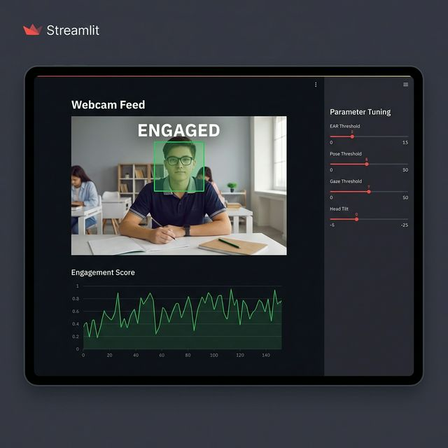

# Student Engagement Monitoring System 👨‍🎓💻


## 📌 Overview

Built for a 2-day university mini-project, this application analyzes a student's webcam feed in real-time to determine if they are **Attentive**, **Distracted**, or **Drowsy**. It leverages computer vision and biometric calculations to provide an automated way to monitor engagement during online classes or study sessions.

## ✨ Features

- **Real-time Webcam Analysis**: Seamlessly integrated using `streamlit-webrtc`.
- **Drowsiness Detection**: Monitors eye closure using the Eye Aspect Ratio (EAR).
- **Attention Tracking**: Uses 3D Head Pose estimation (Yaw, Pitch, Roll) to detect if a student is looking away.
- **Dynamic Calibration**: Sidebar sliders allow users to adjust sensitivity thresholds for different environments.
- **Live Metrics**: Provides a live-updating line chart of the student's engagement score over time.
- **Secure & Private**: Processes video locally or in your private Streamlit Cloud container.

## 🧠 The Science Behind the App

### 1. Eye Aspect Ratio (EAR)

The EAR is used to detect blinks and eye closure.

- **Formula**: $EAR = \frac{||p2 - p6|| + ||p3 - p5||}{2 \times ||p1 - p4||}$
- **Logic**: When the eyes are open, the EAR is relatively constant. When the eyes close, the ratio drops toward zero. If it remains below the threshold for 20+ frames, the student is marked as **Drowsy**.

### 2. Head Pose Estimation

Using OpenCV's `solvePnP`, we map 2D facial landmarks (from MediaPipe Face Mesh) to a generic 3D face model.

- **Euler Angles**: We calculate **Yaw** (side-to-side), **Pitch** (up-down), and **Roll** (tilt).
- **Logic**: If the Yaw or Pitch exceeds 20 degrees, the student is likely looking away from the screen, resulting in a **Distracted** status.

## 🚀 Deployment (Streamlit Cloud)

The app is fully optimized for Streamlit Community Cloud.



### Key Configurations:

- **Python Version**: 3.10 (Optimized for MediaPipe stability).
- **Packages**: `libgl1` and `libglib2.0` included for OpenCV compatibility.
- **WebRTC Settings**: Configured with Google's STUN servers to ensure stable video connections on all networks.

## 🛠️ Local Installation

1. **Clone the Repo**:

   ```bash
   git clone https://github.com/Abinanthan-CG/student-engagement-monitoring.git
   cd student-engagement-monitoring
   ```

2. **Install Dependencies**:

   ```bash
   pip install -r requirements.txt
   ```

3. **Run the App**:
   ```bash
   streamlit run app.py
   ```

## 📜 Technology Stack

- **Frontend**: Streamlit
- **Computer Vision**: MediaPipe, OpenCV
- **Processing**: NumPy, PyAV
- **Webcam Integration**: Streamlit-WebRTC

---

_Created with ❤️ for education._
