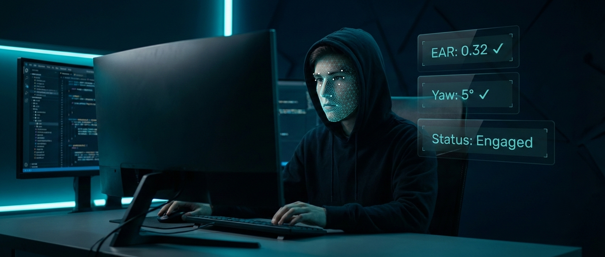
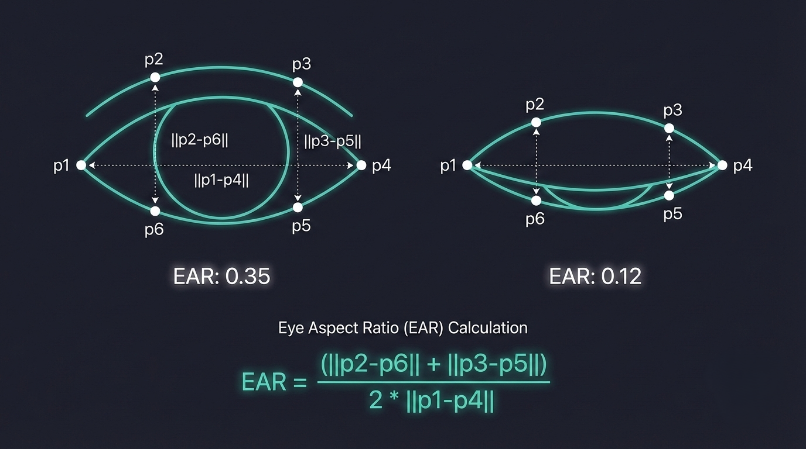
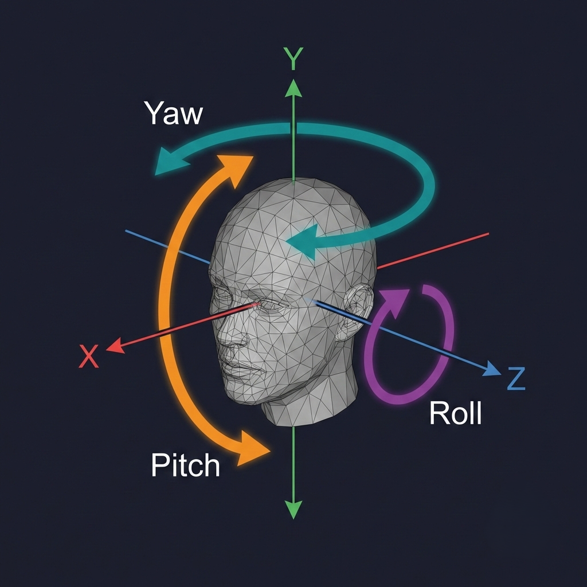

<p align="center">
  
</p>

<h1 align="center">🎓 Student Engagement Monitoring System</h1>

<p align="center">
  <em>Real-time AI-powered attention analysis directly in your browser — no installations, no compromise.</em>
</p>

<p align="center">
  <a href="https://github.com/Abinanthan-CG/student-engagement-monitoring/stargazers">
    
  </a>
  
  
  
  
  
</p>

<br/>

---

## 🚀 Try It Live

[](https://student-engagement-monitoring.streamlit.app/)

> Click the badge above to launch the live app directly in your browser. No setup needed — just allow webcam access and the system will start calibrating.

---

## 🧠 The Science

This project sits at the intersection of geometry, linear algebra, and computer vision. Here's exactly how it works under the hood.

---

### 👁️ Eye Aspect Ratio (EAR) — Drowsiness Detection

The EAR is a simple but surprisingly effective formula introduced by Soukupová & Čech (2016). **The idea**: when your eyes are open, the vertical-to-horizontal distance ratio is roughly constant. When you close your eyes, it drops toward zero.

<p align="center">
  
</p>


| Eyes State                    | Typical EAR | Status        |
| ----------------------------- | ----------- | ------------- |
| Wide open                     | ~0.30–0.45  | ✅ Normal     |
| Squinting / tired             | ~0.20–0.30  | ⚠️ Watch      |
| Below threshold for 25 frames | < 0.20      | 😴 **Drowsy** |

We compute EAR independently for both eyes using MediaPipe's 478 facial landmarks, then smooth the result through a **6-frame rolling mean** to ignore natural blinks.

---

### 🗺️ Head Pose Estimation — Distraction Detection

We use OpenCV's `solvePnP` to figure out exactly where in 3D space your head is pointing from a single 2D webcam image.

<p align="center">
  
</p>

**How it works step by step:**

1. Pick **10 stable facial landmarks** from MediaPipe: nose tip, chin, eye corners, mouth corners, brow points.
2. Match them to a known generic **3D face model** (in millimetres).
3. `solvePnP` solves the geometric transformation to find the 3D rotation that maps the model onto your face.
4. Convert the rotation vector → rotation matrix via `cv2.Rodrigues`.
5. Extract **Yaw, Pitch, and Roll** using `atan2` directly on the matrix — **not** `decomposeProjectionMatrix`, which is notoriously unreliable for face data.

> 🔑 **Why calibration matters**: Everyone naturally sits at a slightly different angle. We record your resting pose over the first 40 frames and subtract it as a baseline — so a naturally tilted head doesn't constantly trigger "Distracted".

---

### ⚖️ The Decision Engine — Hysteresis State Machine

Raw per-frame signals are noisy. We add **temporal hysteresis** so a single blink or quick head turn never flips your status:

```
  Signal                  Counter                  State
  ──────────────────────────────────────────────────────
  EAR < threshold    →   drowsy_count ≥ 25    →   😴 Drowsy
  |yaw| or |pitch|   →   distract_count ≥ 15  →   😵 Distracted
    > threshold
  Everything OK      →   recover_count ≥ 5    →   ✅ Engaged
```

The system requires **sustained evidence** before drawing conclusions. Momentary glances, blinks, and head shifts are all ignored.

---

## ✨ Feature Highlights

| Feature                      | Details                                                                                   |
| ---------------------------- | ----------------------------------------------------------------------------------------- |
| 🎯 **Auto-Calibration**      | 40-frame startup calibration adapts to your personal resting head angle — no manual setup |
| 📊 **Temporal Smoothing**    | EAR averaged over 6 frames; head pose median-filtered over 10 frames                      |
| ⚖️ **Hysteresis Logic**      | State only changes after sustained evidence (15–25 frames), not noisy single frames       |
| 🔢 **Diagnostic HUD**        | Live EAR, calibrated angles, and frame counters displayed directly on the video feed      |
| 🔄 **Reset Button**          | One-click recalibration from the sidebar when you change seats or posture                 |
| 🌐 **WebRTC Streaming**      | Direct browser-to-server video — no file uploads, no RTSP, no latency                     |
| 🎛️ **Adjustable Thresholds** | EAR, Yaw, and Pitch thresholds in a clean collapsible sidebar                             |
| 📈 **Live Scoring Chart**    | Real-time engagement score plotted over the last 120 frames                               |
| 🌑 **Dark UI**               | Premium dark theme with live metric cards for Status, Time Engaged %, and Average Score   |

---

## 🛠️ Local Setup

> **Prerequisites**: Python 3.10, pip, and a working webcam.

```bash
# 1. Clone the repository
git clone https://github.com/Abinanthan-CG/student-engagement-monitoring.git
cd student-engagement-monitoring

# 2. Create a virtual environment (recommended)
python -m venv venv
venv\Scripts\activate        # Windows
source venv/bin/activate     # Mac / Linux

# 3. Install dependencies
pip install -r requirements.txt

# 4. Launch the app
streamlit run app.py
```

The app opens at `http://localhost:8501`. Hold still and look at the screen for ~2 seconds on first launch to calibrate.

---

## 📦 Dependencies

```txt
streamlit
streamlit-webrtc
opencv-python-headless
mediapipe==0.10.14
numpy<2.0.0
av
```

> **Why pin `mediapipe==0.10.14`?** Newer versions removed the `mp.solutions` API. We pin this version for stability.

> **Why `numpy<2.0.0`?** MediaPipe 0.10.x requires NumPy 1.x — they're incompatible with NumPy 2.

---

## ☁️ Streamlit Cloud Deployment

The repo is configured for one-click deployment on [Streamlit Community Cloud](https://share.streamlit.io).

| File               | Purpose                                                          |
| ------------------ | ---------------------------------------------------------------- |
| `requirements.txt` | Python package list                                              |
| `packages.txt`     | Installs `libgl1` and `libglib2.0` (required by OpenCV on Linux) |

> ⚠️ **Important**: In Streamlit Cloud's **Advanced Settings**, select **Python 3.10**. Python 3.12 is not compatible with MediaPipe 0.10.x.

---

## 📁 Project Structure

```
student-engagement-monitoring/
│
├── app.py                      # Main application (single-file)
├── requirements.txt            # Python dependencies
├── packages.txt                # Linux system dependencies (Streamlit Cloud)
├── assets/
│   ├── banner.png              # Hero banner image
│   ├── ear_diagram.png         # EAR formula illustration
│   └── head_pose_diagram.png   # Head pose (Yaw/Pitch/Roll) diagram
└── README.md                   # You're reading it!
```

---

## 🔬 Known Limitations & Future Work

- **Single face**: The system monitors one student at a time.
- **Generic 3D model**: We use an average face for `solvePnP`. A personalized model would improve accuracy.
- **Lighting sensitivity**: Very dim or high-contrast lighting reduces MediaPipe tracking confidence.
- **No audio**: A drowsy student might still be speaking. Multi-modal fusion would help.

**Roadmap ideas:**

- [ ] Iris-based gaze estimation (landmarks already available via `refine_landmarks=True`)
- [ ] Session reports with timestamped engagement breakdowns
- [ ] Teacher dashboard for monitoring multiple students
- [ ] Alerts for prolonged disengagement

---

## 🧑‍💻 About the Author

Built by **Abinanthan** — a computer science student passionate about real-world applications of computer vision and machine learning.

---

<p align="center">
  Made with ❤️, a lot of coffee ☕, and just a little bit of linear algebra.
  <br/>
  <strong>If this helped you, drop a ⭐ on the repo!</strong>
</p>
